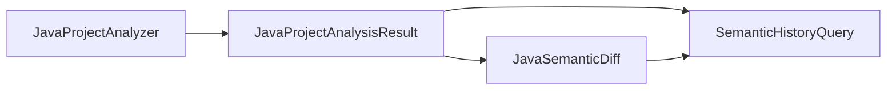

# Five-Minute Quick Start

## Prerequisites

- Java 21
- Maven 3.8+

## Build

```bash
mvn -B verify
```

## Run the Demo

```bash
mvn -pl jgit-storage-hibernate-java-analysis exec:java -Dexec.mainClass=io.github.carstenartur.jgit.storage.hibernate.javaanalysis.demo.SemanticHistoryDemo
```

## What You'll See

The demo prints symbol and reference counts before and after a change, the semantic diff between the two commits, moved symbols, affected callers, unresolved reference counts, and per-method invocation totals.

## How It Works

`JavaProjectAnalyzer` builds binding-aware commit snapshots, `JavaSemanticDiff` compares declarations across commits, and `SemanticHistoryQuery` turns the results into higher-level semantic history queries.



## Next Steps

Continue with the [Semantic History Query Cookbook](query-cookbook.md).
